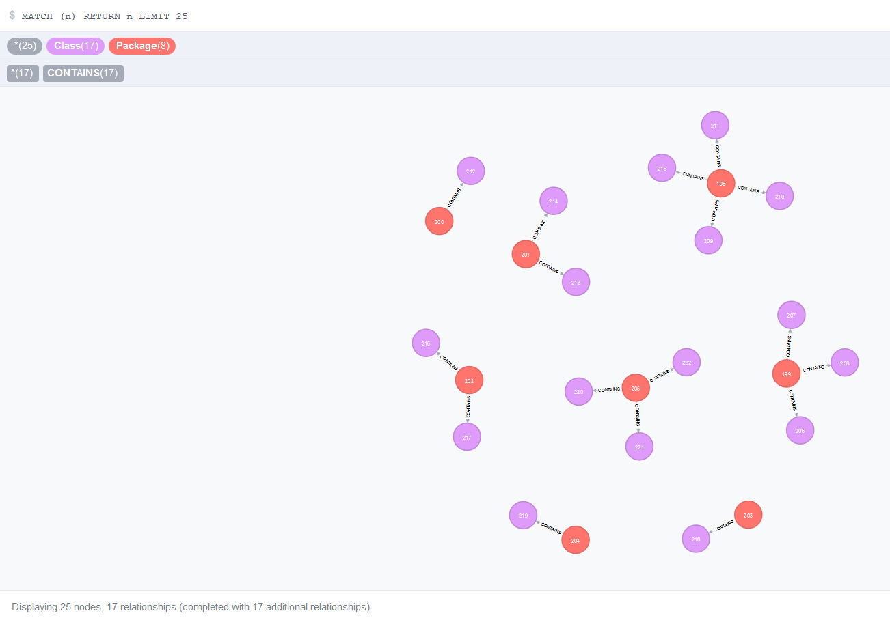

### Graph DB and Source Code analysis exploration

This project is a mix of source code analysis and graphDB creation/manipulation

Example of using Neo4J to represent dependencies between classes based on imports and package/class declarations :

